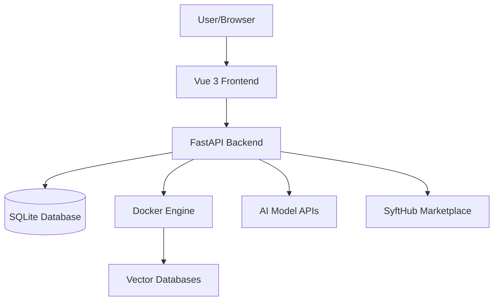
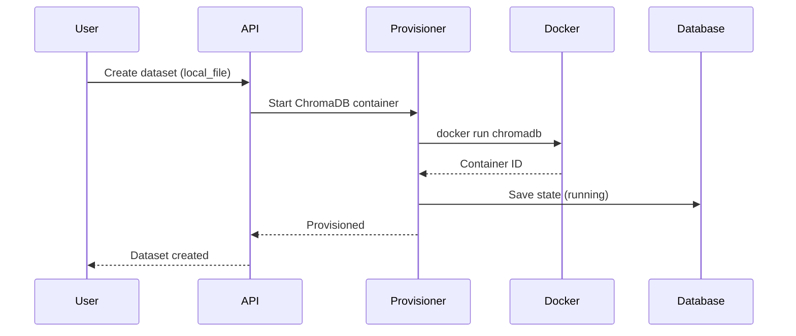

Syft Space is built as a modern full-stack application using FastAPI, Vue 3, and a domain-driven design architecture.

## System overview



## Core components

### Frontend (Vue 3)

The frontend is a single-page application built with:

- **Vue 3** with Composition API and TypeScript
- **Tailwind CSS** for styling
- **Pinia** for state management
- **Vue Router** for navigation
- **Axios** for API communication

**Structure:**

```
frontend/
├── src/
│   ├── pages/          # Page components
│   ├── components/     # Reusable UI components
│   ├── composables/    # Shared business logic
│   ├── stores/         # Pinia state stores
│   └── api/            # API client and types
```

### Backend (FastAPI)

The backend uses FastAPI with a domain-driven design pattern:

**Component structure:**

```
backend/syft_space/components/
├── datasets/
│   ├── entities.py         # Database models
│   ├── schemas.py          # Request/response models
│   ├── repository.py       # Data access layer
│   ├── handlers.py         # Business logic
│   └── routes.py           # API endpoints
├── models/
├── endpoints/
├── policies/
└── shared/                 # Common utilities
```

**Key technologies:**

- **FastAPI** - Web framework
- **SQLModel** - ORM with Pydantic integration
- **Alembic** - Database migrations
- **Loguru** - Structured logging
- **Pydantic** - Data validation

## Type registry pattern

Syft Space uses a plugin-style registry pattern for extensibility:

```python
# Register built-in types at startup
register_dataset_types()
register_model_types()
register_policy_types()

# Types are registered in global registries
DATASET_TYPE_REGISTRY
MODEL_TYPE_REGISTRY
POLICY_TYPE_REGISTRY
```

This allows:

- Adding new dataset types (e.g., Pinecone, Milvus)
- Adding new model providers (e.g., Cohere, Gemini)
- Adding new policy types (e.g., quota, throttling)

## Multi-tenancy

Syft Space implements tenant isolation:

**Tenant middleware** (`tenants/middleware.py`):

- Extracts tenant from JWT token or X-Tenant-Name header
- Injects tenant context into all requests
- Ensures data isolation between tenants

**Data isolation:**

```python
class Dataset(BaseEntity):
    tenant_name: str  # Every entity belongs to a tenant
```

All queries are automatically scoped to the current tenant.

## Provisioning system

Automatic Docker provisioning for vector databases:



**Provisioner manager** manages:

- Container lifecycle (start/stop/cleanup)
- Port allocation
- Volume management
- Health monitoring
- State persistence

## Authentication & authorization

### Authentication

Two auth modes:

1. **Local auth** - Bearer token from login
2. **SyftHub auth** - Satellite token from marketplace

**Auth middleware** (`auth/middleware.py`):

```python
bearer_scheme = HTTPBearer()

async def get_verified_user_email(token: str) -> str:
    # Verify JWT and extract user email
```

### Authorization

Policy-based authorization:

- **Access policies** control who can query endpoints
- **Rate limit policies** control query frequency
- **Accounting policies** track usage and costs

## Database architecture

**SQLite with async support:**

```python
class AsyncDatabase:
    def __init__(self, config: SQLiteConfig):
        self.engine = create_async_engine(
            config.database_url,
            connect_args={"check_same_thread": False}
        )
```

**Migrations** managed by Alembic:

```bash
alembic upgrade head  # Apply migrations
alembic revision --autogenerate -m "description"
```

## Lifecycle management

Components implement `LifecycleService` protocol:

```python
class LifecycleService(Protocol):
    async def startup(self) -> None: ...
    async def shutdown(self) -> None: ...
```

**Startup sequence:**

1. Initialize database
2. Register type registries
3. Start provisioner manager
4. Start ingestion manager
5. Start heartbeat manager
6. Sync marketplace state

**Shutdown sequence:**

1. Stop background tasks
2. Cleanup provisioned resources
3. Close database connections

## Background services

### Ingestion manager

Processes file uploads asynchronously:

- Queue-based task processing
- File watching for auto-ingestion
- Chunking and embedding generation
- Progress tracking

### Heartbeat manager

Monitors system health:

- Periodic health checks
- Marketplace status sync
- Endpoint availability monitoring

### Proxy service

Manages ngrok tunnels:

- Automatic tunnel creation
- Public URL management
- Connection monitoring

## API versioning

All endpoints are versioned:

```python
api_router = APIRouter(prefix="/api/v1")
```

Future versions can coexist:

- `/api/v1/endpoints/`
- `/api/v2/endpoints/` (future)

## Error handling

Consistent error responses:

```python
class AppException(Exception):
    status_code: int
    detail: str

raise DatasetNotFoundError(name="my-dataset")
# Returns: {"detail": "Dataset 'my-dataset' not found"}
```

## Performance considerations

- **Async/await** throughout for concurrency
- **Connection pooling** for database
- **Caching** for type registries and schemas
- **Batch operations** for policy evaluation
- **Streaming responses** for large queries

## Security architecture

- **JWT tokens** for authentication
- **Tenant isolation** at data layer
- **Input validation** with Pydantic
- **SQL injection protection** via SQLModel
- **CORS** configured for trusted origins
- **Rate limiting** via policies

## Extensibility points

1. **Dataset types** - Add new data sources
2. **Model types** - Add new AI providers
3. **Policy types** - Add new access controls
4. **Middlewares** - Add custom request processing
5. **Background services** - Add scheduled tasks

<Info>
  See [Custom integrations](/advanced/custom-integrations) for implementation guides.
</Info>
