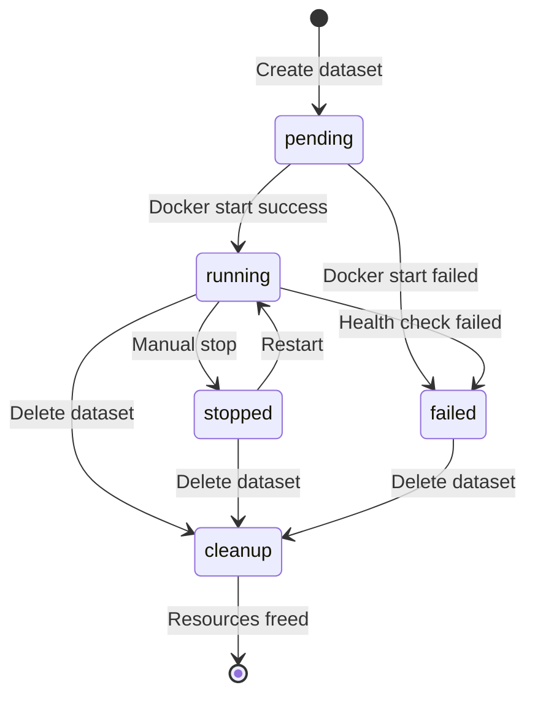

Syft Space supports multiple vector database backends for document storage and semantic search.

## Supported databases

<CardGroup cols={2}>
  <Card title="ChromaDB" icon="database">
    Local embedded database, auto-provisioned via Docker
  </Card>
  <Card title="Weaviate" icon="server">
    Remote or local, supports GraphQL and REST
  </Card>
  <Card title="Qdrant" icon="database">
    High-performance vector search (coming soon)
  </Card>
  <Card title="Pinecone" icon="cloud">
    Managed cloud service (planned)
  </Card>
</CardGroup>

## ChromaDB (local)

ChromaDB is automatically provisioned when creating a local dataset.

### Auto-provisioning

When you create a dataset with type `local_file`:

```python
{
  "name": "my-docs",
  "dtype": "local_file",
  "configuration": {
    "connection_override": null  # Auto-provision
  }
}
```

Syft Space automatically:

1. Pulls `chromadb/chroma:latest` Docker image
2. Starts container with unique name and port
3. Creates persistent volume for data
4. Monitors container health
5. Stores connection info in database

### Manual connection

Connect to existing ChromaDB instance:

```python
{
  "name": "my-docs",
  "dtype": "local_file",
  "configuration": {
    "connection_override": {
      "host": "localhost",
      "port": 8000
    }
  }
}
```

### Container lifecycle

**Provisioner states:**

- `pending` - Provisioning requested
- `running` - Container active and healthy
- `stopped` - Container stopped
- `failed` - Provisioning failed
- `cleanup` - Cleanup in progress

**State transitions:**



### Resource management

ChromaDB containers use:

- **CPU**: 0.5 cores (soft limit)
- **Memory**: 512MB (soft limit)
- **Storage**: Persistent Docker volume
- **Ports**: Automatically allocated (8000+)

<Info>
  Check provisioner status via `GET /api/v1/datasets/{name}` endpoint.
</Info>

## Weaviate (remote)

Connect to existing Weaviate instance (local or cloud).

### Configuration

```python
{
  "name": "my-remote-db",
  "dtype": "remote_weaviate",
  "configuration": {
    "url": "https://my-cluster.weaviate.network",
    "api_key": "your-api-key",  # Optional
    "class_name": "Document"     # Weaviate class
  }
}
```

### Weaviate cloud

Using Weaviate Cloud Services (WCS):

<Steps>
  <Step title="Create cluster">
    Sign up at [Weaviate Cloud](https://console.weaviate.cloud/) and create a cluster
  </Step>
  <Step title="Get credentials">
    Copy cluster URL and API key from dashboard
  </Step>
  <Step title="Create class">
    Define schema for your documents:
    ```graphql
    {
      class: "Document",
      vectorizer: "text2vec-openai",
      properties: [
        { name: "content", dataType: ["text"] },
        { name: "metadata", dataType: ["object"] }
      ]
    }
    ```
  </Step>
  <Step title="Connect in Syft Space">
    Create dataset with remote_weaviate type and your credentials
  </Step>
</Steps>

### Local Weaviate

Run Weaviate locally with Docker:

```bash
docker run -d \
  --name weaviate \
  -p 8080:8080 \
  -e AUTHENTICATION_ANONYMOUS_ACCESS_ENABLED=true \
  -e PERSISTENCE_DATA_PATH=/var/lib/weaviate \
  semitechnologies/weaviate:latest
```

Then connect:

```python
{
  "url": "http://localhost:8080",
  "api_key": null,
  "class_name": "Document"
}
```

## Qdrant (coming soon)

Qdrant support planned for future release.

**Planned features:**

- Auto-provisioning like ChromaDB
- Quantization for reduced memory
- Payload indexing for filtering
- Batch operations for performance

## Embedding models

Vector databases require embeddings for semantic search.

### OpenAI embeddings

Used with ChromaDB:

```python
# Automatic during ingestion
embeddings = openai.embeddings.create(
    model="text-embedding-3-small",
    input=chunks
)
```

**Models:**

- `text-embedding-3-small` - 1536 dimensions, low cost
- `text-embedding-3-large` - 3072 dimensions, high quality
- `text-embedding-ada-002` - Legacy, 1536 dimensions

### Weaviate vectorizers

Weaviate can use built-in vectorizers:

- `text2vec-openai` - OpenAI embeddings
- `text2vec-cohere` - Cohere embeddings
- `text2vec-huggingface` - Local models
- `text2vec-transformers` - Local transformers

## Document ingestion

Documents are processed and embedded during ingestion:

### Chunking strategy

```python
# Default configuration
CHUNK_SIZE = 1000        # Characters per chunk
CHUNK_OVERLAP = 200      # Overlap between chunks
```

**Process:**

1. Extract text from files (PDF, DOCX, TXT, etc.)
2. Split into overlapping chunks
3. Generate embeddings for each chunk
4. Store in vector database with metadata

### Supported file formats

- **Text**: .txt, .md, .csv
- **Documents**: .pdf, .docx, .odt
- **Code**: .py, .js, .java, .cpp
- **Data**: .json, .xml, .yaml

## Search and retrieval

Vector databases enable semantic search:

### Similarity search

```python
# Query process
1. Embed query text
2. Find similar vectors (cosine similarity)
3. Return top-k results
4. Include metadata and scores
```

**Parameters:**

- `similarity_threshold` - Minimum similarity score (0.0-1.0)
- `limit` - Maximum results to return
- `include_metadata` - Include document metadata

### Hybrid search

Combine vector search with keyword filtering:

```python
# Weaviate GraphQL
{
  Get {
    Document(
      nearText: { concepts: ["machine learning"] }
      where: { path: ["category"], operator: Equal, valueString: "AI" }
    ) {
      content
      _additional { distance }
    }
  }
}
```

## Performance optimization

### Indexing

**ChromaDB:**

- HNSW (Hierarchical Navigable Small World) index
- Automatic index building
- In-memory for fast queries

**Weaviate:**

- HNSW index with configurable parameters
- Disk-based with caching
- Quantization for memory efficiency

### Batch operations

Ingest documents in batches:

```python
# Batch size for ingestion
BATCH_SIZE = 100

# Process files in batches
for batch in chunks(files, BATCH_SIZE):
    embeddings = embed_batch(batch)
    collection.add(embeddings)
```

### Caching

Cache frequently accessed results:

- Query result caching (5 min TTL)
- Embedding caching for common queries
- Metadata caching

## Monitoring

Track database health and performance:

### Health checks

```bash
# ChromaDB health
GET http://localhost:8000/api/v1/heartbeat

# Weaviate health
GET http://localhost:8080/v1/.well-known/ready
```

### Metrics

Track in application logs:

- Query latency (p50, p95, p99)
- Index size and growth
- Memory usage
- Document count
- Failed queries

## Backup and restore

### ChromaDB

Backup Docker volume:

```bash
# Backup
docker run --rm \
  -v syft-space-chroma-{id}:/data \
  -v $(pwd):/backup \
  alpine tar czf /backup/chroma-backup.tar.gz /data

# Restore
docker run --rm \
  -v syft-space-chroma-{id}:/data \
  -v $(pwd):/backup \
  alpine tar xzf /backup/chroma-backup.tar.gz -C /
```

### Weaviate

Use Weaviate backup module:

```bash
# Backup to S3
POST /v1/backups/s3
{
  "id": "backup-2024-01-01",
  "include": ["Document"]
}
```

<Warning>
  Always test restore procedures before relying on backups.
</Warning>

## Troubleshooting

<Accordion title="Container won't start">
  Check Docker logs:
  ```bash
  docker logs syft-space-chroma-{id}
  ```
  
  Common issues:
  - Port already in use
  - Insufficient memory
  - Docker daemon not running
</Accordion>

<Accordion title="Slow queries">
  - Reduce `limit` parameter
  - Increase `similarity_threshold`
  - Check database size (reindex if needed)
  - Monitor container resources
</Accordion>

<Accordion title="Connection errors">
  - Verify network connectivity
  - Check firewall rules
  - Validate API keys/credentials
  - Ensure service is running
</Accordion>
