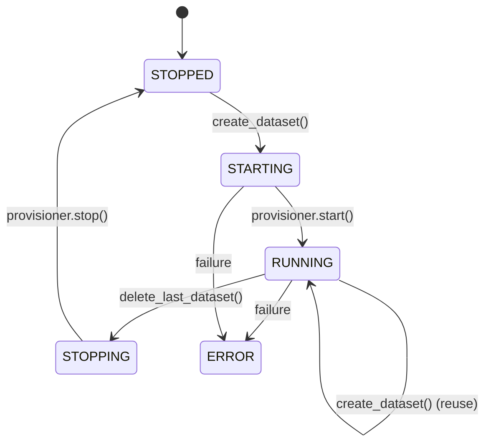
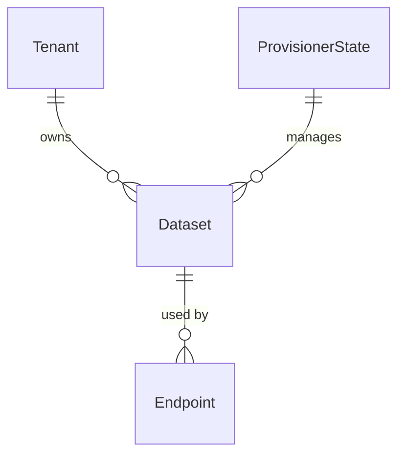

Datasets represent configured instances of vector databases that store and search your private data. Each dataset is backed by a **dataset type** that defines how data is stored, searched, and managed.

## Dataset entity

A dataset is defined by the following properties:

```python
class Dataset:
    id: UUID                    # Unique identifier
    tenant_id: UUID             # Tenant isolation
    name: str                   # Unique name per tenant
    dtype: str                  # Dataset type (e.g., "weaviate", "chromadb_local")
    configuration: dict         # Type-specific config
    summary: str                # Brief description
    tags: str                   # Comma-separated tags
    provisioner_state_id: UUID  # Link to shared provisioner (for local types)
    created_at: datetime
    updated_at: datetime
```

Location: `backend/syft_space/components/datasets/entities.py:47`

## Dataset types

Dataset types implement the `BaseDatasetType` protocol and provide:

### Configuration schema

Each type defines required fields:

```python
@classmethod
def configuration_schema(cls) -> dict[str, Any]:
    """Return configuration schema for this dataset type."""
    return {
        "httpPort": {"type": "integer", "required": True},
        "grpcPort": {"type": "integer", "required": True},
        "collectionName": {"type": "string", "required": True}
    }
```

### Search interface

All dataset types implement search functionality:

```python
async def search(
    self,
    ctx: SearchContext,
    query: str,
    params: SearchParameters | None = None
) -> SearchResult:
    """Search the dataset for matching documents."""
```

**SearchParameters** (from `interfaces.py:25`):
- `similarity_threshold` (float): Minimum similarity score (0.0-1.0)
- `limit` (int): Maximum number of results
- `include_metadata` (bool): Whether to include document metadata

**SearchResult** contains:
- `documents`: List of `SearchedDocument` objects
  - `document_id`: Unique document identifier
  `content`: Document text
  - `metadata`: Custom metadata dict
  - `similarity_score`: Relevance score (0.0-1.0)

Location: `backend/syft_space/components/dataset_types/interfaces.py:55`

## Available dataset types

### Weaviate (remote)

**Type name**: `weaviate`

Cloud or self-hosted Weaviate vector database.

**Configuration**:
```json
{
  "httpPort": 8080,
  "grpcPort": 50051,
  "collectionName": "MyCollection",
  "ingestionPath": "/data/documents"
}
```

**No provisioner**: Weaviate runs externally, you provide connection details.

### ChromaDB (local)

**Type name**: `chromadb_local`

Local ChromaDB instance managed by Syft Space.

**Configuration**:
```json
{
  "collectionName": "MyCollection",
  "ingestionPath": "/data/documents"
}
```

**Has provisioner**: Syft Space automatically starts/stops ChromaDB containers.

## Provisioners

**Provisioners** manage the lifecycle of local dataset infrastructure (containers, processes). They are shared across all datasets of the same type.

### Provisioner lifecycle



Location: `backend/syft_space/components/datasets/entities.py:16`

### Provisioner state

Shared state is tracked in the database:

```python
class ProvisionerState:
    id: UUID
    dtype: str              # One provisioner per dataset type
    state: dict             # Connection config + runtime info (container_id, ports)
    status: str             # STOPPED, STARTING, RUNNING, STOPPING, ERROR
    started_at: datetime
    stopped_at: datetime
    error: str | None
```

Location: `backend/syft_space/components/datasets/entities.py:113`

### Key provisioner behaviors

<Info>
**Shared provisioners**: Multiple datasets of the same type share one provisioner. When you create a second ChromaDB dataset, it reuses the existing ChromaDB container.
</Info>

<Warning>
**Connection field override**: When a provisioner is running, new datasets inherit connection fields (ports, URLs) from the provisioner state, ignoring user-provided values.
</Warning>

Location: `backend/syft_space/components/datasets/handlers.py:377`

### Startup/shutdown

Provisioners are automatically managed:

1. **On app startup** (`startup_all_provisioners`):
   - Finds all provisioners with attached datasets
   - Starts them if not already running
   - Recovers from stuck STARTING/STOPPING states

2. **On app shutdown** (`shutdown_all_provisioners`):
   - Stops all running provisioners
   - Best-effort (continues on errors)

Location: `backend/syft_space/components/datasets/handlers.py:194`

## Data ingestion

Datasets that implement `IngestableDatasetType` support file uploads:

```python
async def ingest(
    self,
    ctx: IngestContext,
    request: IngestRequest
) -> None:
    """Ingest files into the dataset."""
```

**IngestRequest** contains:
- `files`: List of `IngestFile` objects
  - `file_handle`: File-like object (BytesIO, SpooledTemporaryFile)
  - `filename`: Original filename
  - `content_type`: MIME type
  - `file_size`: Size in bytes

Location: `backend/syft_space/components/dataset_types/interfaces.py:206`

### File watching

Datasets can monitor directories for new files:

```python
class FileIngestableDatasetType:
    def watched_paths(self) -> list[str]:
        """Paths to monitor for new files."""
    
    def allowed_extensions(self) -> set[str]:
        """File extensions to accept (e.g., {".pdf", ".txt"})."""
```

Location: `backend/syft_space/components/dataset_types/interfaces.py:233`

## Dataset operations

### Create dataset

```python
async def create_dataset(
    request: CreateDatasetRequest,
    tenant: Tenant
) -> DatasetResponse:
    """
    1. Validates dataset type exists
    2. Validates configuration
    3. Ensures provisioner is running (starts if needed)
    4. Overrides connection fields from provisioner state
    5. Creates dataset entity
    """
```

Location: `backend/syft_space/components/datasets/handlers.py:333`

### Delete dataset

```python
async def delete_dataset(name: str, tenant: Tenant) -> dict:
    """
    1. Deletes dataset type resources (collections, files)
    2. Deletes database record
    3. DOES NOT stop provisioner (it may be shared)
    """
```

<Warning>
Deleting a dataset does NOT stop its provisioner. Use admin endpoints to manually stop/delete provisioners if needed.
</Warning>

Location: `backend/syft_space/components/datasets/handlers.py:494`

### Healthcheck

Check if a dataset's connection is healthy:

```python
async def healthcheck(name: str, tenant: Tenant) -> HealthcheckResponse:
    """
    Returns:
    - dataset_type_status: Connection health (HEALTHY/UNHEALTHY)
    - provisioner_status: Provisioner state (if local type)
    - message: Details
    """
```

Location: `backend/syft_space/components/datasets/handlers.py:544`

## Connection fields

Dataset types define which configuration fields are connection-related:

```python
@classmethod
def connection_fields(cls) -> list[str]:
    """Fields shared across datasets via provisioner.
    
    Example for Weaviate: ["httpPort", "grpcPort"]
    """
```

These fields are:
- Shared across all datasets of the same type
- Overridden from provisioner state when creating new datasets
- Stored in `ProvisionerState.state`

Non-connection fields (e.g., `collectionName`, `ingestionPath`) remain unique per dataset.

Location: `backend/syft_space/components/dataset_types/interfaces.py:188`

## Relationships

- **Tenant**: Each dataset belongs to one tenant
- **Endpoints**: One dataset can be used by multiple endpoints
- **ProvisionerState**: Local datasets link to shared provisioner state



## Example workflow

<Steps>
  <Step title="Create ChromaDB dataset">
    POST `/api/v1/datasets` with `dtype: "chromadb_local"`
    
    Backend starts ChromaDB provisioner (first time)
  </Step>
  
  <Step title="Ingest documents">
    POST `/api/v1/datasets/{name}/ingest` with PDF files
    
    Files are chunked and embedded into collection
  </Step>
  
  <Step title="Create second dataset">
    POST `/api/v1/datasets` with different `collectionName`
    
    Reuses existing ChromaDB provisioner
  </Step>
  
  <Step title="Query via endpoint">
    Create endpoint linking to dataset
    
    Query endpoint → searches dataset → returns results
  </Step>
</Steps>

## Next steps

<CardGroup cols={2}>
  <Card title="Models" icon="brain" href="/concepts/models">
    Learn how to connect AI models for response generation
  </Card>
  <Card title="Endpoints" icon="plug" href="/concepts/endpoints">
    Combine datasets and models into queryable endpoints
  </Card>
</CardGroup>
