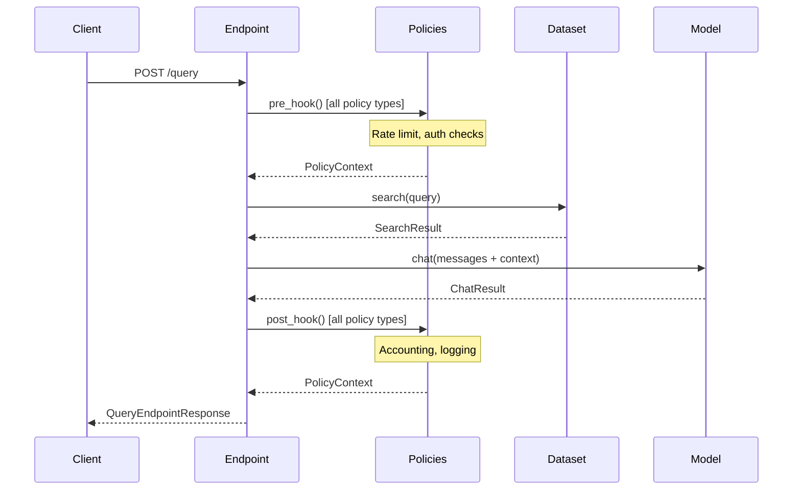
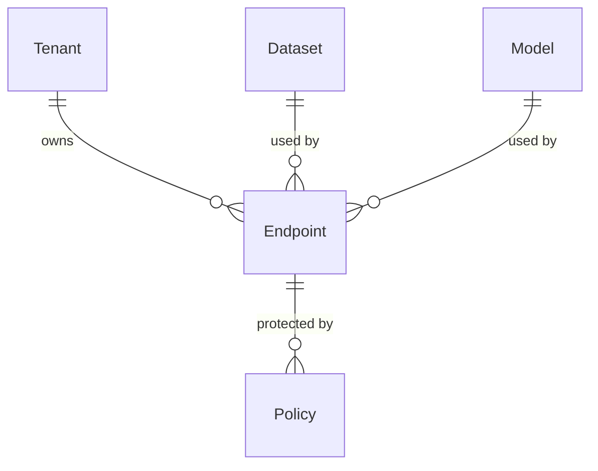

Endpoints are the primary interface for querying Syft Space. They combine datasets, models, and policies into a single API that clients can query to retrieve information or generate responses.

## Endpoint entity

An endpoint is defined by the following properties:

```python
class Endpoint:
    id: UUID                # Unique identifier
    tenant_id: UUID         # Tenant isolation
    name: str               # Display name
    slug: str               # URL path (unique per tenant)
    description: str        # Markdown documentation
    summary: str            # Brief description
    dataset_id: UUID | None # Linked dataset (optional)
    model_id: UUID | None   # Linked model (optional)
    response_type: str      # "raw", "summary", or "both"
    published: bool         # Whether endpoint is queryable
    tags: str               # Comma-separated tags
    published_to: list[str] # Marketplace IDs where published
    created_at: datetime
    updated_at: datetime
```

Location: `backend/syft_space/components/endpoints/entities.py:27`

<Note>
At least one of `dataset_id` or `model_id` must be provided. An endpoint cannot exist without connecting to either a dataset or a model.
</Note>

## Response types

Endpoints support three response configurations:

```python
class ResponseType(Enum):
    RAW = "raw"          # Dataset search only
    SUMMARY = "summary"  # Model generation only
    BOTH = "both"        # Dataset search + model generation (RAG)
```

Location: `backend/syft_space/components/endpoints/entities.py:19`

### Response type behaviors

<Tabs>
  <Tab title="Raw">
    **Dataset only** - returns search results without model processing.
    
    **Query flow**:
    1. Search dataset with user query
    2. Return matching documents
    
    **Response structure**:
    ```json
    {
      "references": {
        "documents": [
          {
            "document_id": "doc123",
            "content": "Document text...",
            "similarity_score": 0.92,
            "metadata": {}
          }
        ],
        "provider_info": {"search_engine": "weaviate"},
        "cost": 0.0
      },
      "summary": null
    }
    ```
    
    **Use cases**: Document retrieval, similarity search, fact lookup
  </Tab>
  
  <Tab title="Summary">
    **Model only** - returns generated text without dataset context.
    
    **Query flow**:
    1. Send user messages to model
    2. Return generated response
    
    **Response structure**:
    ```json
    {
      "summary": {
        "id": "chatcmpl-...",
        "model": "gpt-4",
        "message": {
          "role": "assistant",
          "content": "Generated response...",
          "tokens": 42
        },
        "finish_reason": "stop",
        "usage": {"total_tokens": 150},
        "cost": 0.0025
      },
      "references": null
    }
    ```
    
    **Use cases**: Chatbots, creative writing, general Q&A
  </Tab>
  
  <Tab title="Both">
    **Dataset + Model (RAG)** - searches dataset then generates response with context.
    
    **Query flow**:
    1. Search dataset for relevant documents
    2. Inject top results as context into model prompt
    3. Generate response grounded in retrieved documents
    
    **Response structure**:
    ```json
    {
      "references": {
        "documents": [{...}],
        "provider_info": {},
        "cost": 0.001
      },
      "summary": {
        "message": {"content": "Based on the documents..."},
        "usage": {"total_tokens": 200},
        "cost": 0.003
      }
    }
    ```
    
    **Use cases**: Knowledge base Q&A, document-grounded chat, expert systems
  </Tab>
</Tabs>

## Query flow

When a client queries an endpoint, the following pipeline executes:



Location: `backend/syft_space/components/endpoints/handlers.py:236`

### Step-by-step execution

<Steps>
  <Step title="Authentication">
    Verify request has valid SyftHub token
    
    Extract `sender_email` from token for policy context
  </Step>
  
  <Step title="Pre-hook policies">
    Execute all attached policies' `pre_hook()` methods
    
    ```python
    for policy_type, configs in policies_by_type.items():
        policy_instance.pre_hook(configs, context)
    ```
    
    Policies can:
    - Block request (raise `PolicyViolationError`)
    - Modify context/request
    - Perform authorization checks
  </Step>
  
  <Step title="Dataset search (if configured)">
    Search dataset with user query:
    
    ```python
    if response_type in [RAW, BOTH] and dataset_id:
        result = await dataset.search(ctx, query, params)
    ```
    
    Parameters from request:
    - `similarity_threshold`
    - `limit`
    - `include_metadata`
  </Step>
  
  <Step title="Model chat (if configured)">
    Generate response with optional context injection:
    
    ```python
    if response_type in [SUMMARY, BOTH] and model_id:
        # Inject search results as context
        if references:
            messages.insert(0, system_context_message)
        
        result = await model.chat(ctx, messages, params)
    ```
    
    Parameters from request:
    - `temperature`
    - `max_tokens`
    - `stop_sequences`
  </Step>
  
  <Step title="Post-hook policies">
    Execute all attached policies' `post_hook()` methods
    
    ```python
    for policy_type, configs in policies_by_type.items():
        policy_instance.post_hook(configs, context)
    ```
    
    Policies can:
    - Block response (raise `PolicyViolationError`)
    - Record accounting transaction
    - Log usage metrics
  </Step>
  
  <Step title="Return response">
    Return combined result to client
    
    Response shape depends on `response_type`
  </Step>
</Steps>

Location: `backend/syft_space/components/endpoints/handlers.py:236`

## Query request schema

```python
class QueryEndpointRequest:
    messages: str | list[ChatMessageRequest]  # User input
    similarity_threshold: float = 0.5         # Dataset search threshold
    limit: int = 5                            # Max search results
    include_metadata: bool = True             # Include doc metadata
    max_tokens: int = 100                     # Model max tokens
    temperature: float = 0.7                  # Model temperature
    stop_sequences: list[str] = ["\n"]        # Model stop tokens
    stream: bool = False                      # Streaming mode
    presence_penalty: float = 0.0             # Model penalty
    frequency_penalty: float = 0.0            # Model penalty
    extras: dict = {}                         # Additional options
    transaction_token: str | None = None      # Accounting token
```

Location: `backend/syft_space/components/endpoints/schemas.py:212`

<Info>
The `messages` field accepts either a simple string (converted to `[{"role": "user", "content": "..."}]`) or a full conversation array.
</Info>

## Authenticated requests

All endpoint queries require authentication:

```python
class AuthenticatedQueryRequest(QueryEndpointRequest):
    sender_email: EmailStr  # Extracted from SyftHub token
```

The `sender_email` is:
- Verified from the authorization token (not user-provided)
- Injected into `PolicyContext` for all policy hooks
- Used for audit logging and usage tracking

Location: `backend/syft_space/components/endpoints/schemas.py:273`

## Slug validation

Endpoint slugs must follow strict rules:

```python
@field_validator("slug")
def validate_slug(v: str) -> str:
    v = v.lower()
    
    # Length: 3-64 characters
    if len(v) < 3 or len(v) > 64:
        raise ValueError("Slug must be 3-64 characters")
    
    # Pattern: lowercase letters, numbers, hyphens
    # No leading/trailing/consecutive hyphens
    if not re.match(r"^[a-z0-9]+(-[a-z0-9]+)*$", v):
        raise ValueError("Invalid slug format")
    
    return v
```

Location: `backend/syft_space/components/endpoints/schemas.py:29`

**Valid**: `my-endpoint`, `legal-qa-v2`, `docs123`

**Invalid**: `My-Endpoint` (uppercase), `-docs` (leading hyphen), `my--endpoint` (consecutive hyphens)

## Marketplace publishing

Endpoints can be published to SyftHub marketplaces:

```python
async def publish_endpoint(
    slug: str,
    marketplace_ids: list[UUID] | None,
    publish_to_all_marketplaces: bool,
    tenant: Tenant
) -> PublishEndpointResponse:
    """
    1. Validates marketplace exists and is active
    2. Authenticates to marketplace with credentials
    3. Publishes endpoint metadata via SyftHub API
    4. Records publication in endpoint.published_to
    """
```

Location: `backend/syft_space/components/endpoints/handlers.py:542`

### Publish payload

Published endpoints include:

```python
{
    "name": endpoint.name,
    "description": endpoint.summary,
    "type": endpoint_type,  # "model_data_source", "model", or "data_source"
    "slug": endpoint.slug,
    "readme": endpoint.description,  # Markdown documentation
    "policies": [...]  # Attached policy configurations
    "connect": [{
        "type": "https",
        "config": {"path": f"/api/v1/endpoints/{slug}/query"}
    }]
}
```

Location: `backend/syft_space/components/endpoints/handlers.py:911`

### Sync endpoints

Batch update all published endpoints:

```python
async def sync_endpoints_to_marketplaces(
    tenant: Tenant
) -> dict[str, list[str]]:
    """
    Groups all published endpoints by marketplace
    Calls sync_endpoints API for each marketplace
    Returns synced endpoint slugs per marketplace
    """
```

Location: `backend/syft_space/components/endpoints/handlers.py:963`

## Endpoint operations

### Create endpoint

```python
async def create_endpoint(
    request: CreateEndpointRequest,
    tenant: Tenant
) -> EndpointCreateResponse:
    """
    1. Validates at least one of dataset_id or model_id
    2. Checks slug uniqueness
    3. Verifies dataset and model exist (if provided)
    4. Creates endpoint entity
    """
```

Location: `backend/syft_space/components/endpoints/handlers.py:92`

### Update endpoint

Partial updates (name, summary, description):

```python
async def update_endpoint(
    slug: str,
    request: UpdateEndpointRequest,
    tenant: Tenant
) -> EndpointDetailResponse:
    """Updates metadata fields only."""
```

<Warning>
You cannot change `dataset_id`, `model_id`, or `response_type` after creation. Delete and recreate the endpoint instead.
</Warning>

Location: `backend/syft_space/components/endpoints/handlers.py:189`

### Delete endpoint

```python
async def delete_endpoint(slug: str, tenant: Tenant) -> dict:
    """
    Deletes endpoint and all attached policies.
    Does NOT delete the linked dataset or model.
    """
```

Location: `backend/syft_space/components/endpoints/handlers.py:217`

## Relationships



- **Tenant**: Each endpoint belongs to one tenant
- **Dataset**: Endpoint can link to one dataset (optional)
- **Model**: Endpoint can link to one model (optional)
- **Policies**: Multiple policies can be attached to an endpoint

## Example workflows

<Tabs>
  <Tab title="RAG endpoint">
    <Steps>
      <Step title="Create dataset">
        POST `/api/v1/datasets`
        
        ```json
        {
          "name": "legal-docs",
          "dtype": "weaviate",
          "configuration": {...}
        }
        ```
      </Step>
      
      <Step title="Create model">
        POST `/api/v1/models`
        
        ```json
        {
          "name": "gpt-4",
          "dtype": "openai",
          "configuration": {"api_key": "..."}
        }
        ```
      </Step>
      
      <Step title="Create endpoint">
        POST `/api/v1/endpoints`
        
        ```json
        {
          "slug": "legal-qa",
          "dataset_id": "<dataset-uuid>",
          "model_id": "<model-uuid>",
          "response_type": "both",
          "published": true
        }
        ```
      </Step>
      
      <Step title="Query endpoint">
        POST `/api/v1/endpoints/legal-qa/query`
        
        ```json
        {
          "messages": "What are the copyright terms?",
          "limit": 5,
          "temperature": 0.7
        }
        ```
        
        Returns search results + AI-generated answer
      </Step>
    </Steps>
  </Tab>
  
  <Tab title="Search-only endpoint">
    <Steps>
      <Step title="Create dataset">
        Configure vector database with documents
      </Step>
      
      <Step title="Create endpoint">
        ```json
        {
          "slug": "doc-search",
          "dataset_id": "<dataset-uuid>",
          "model_id": null,
          "response_type": "raw"
        }
        ```
      </Step>
      
      <Step title="Query">
        Returns only search results, no generation
      </Step>
    </Steps>
  </Tab>
  
  <Tab title="Chat-only endpoint">
    <Steps>
      <Step title="Create model">
        Configure OpenAI or vLLM model
      </Step>
      
      <Step title="Create endpoint">
        ```json
        {
          "slug": "chatbot",
          "dataset_id": null,
          "model_id": "<model-uuid>",
          "response_type": "summary"
        }
        ```
      </Step>
      
      <Step title="Query">
        Returns only AI-generated response, no search
      </Step>
    </Steps>
  </Tab>
</Tabs>

## Next steps

<CardGroup cols={2}>
  <Card title="Policies" icon="shield" href="/concepts/policies">
    Protect endpoints with rate limiting and access controls
  </Card>
  <Card title="Datasets" icon="database" href="/concepts/datasets">
    Learn about dataset types and data ingestion
  </Card>
</CardGroup>
