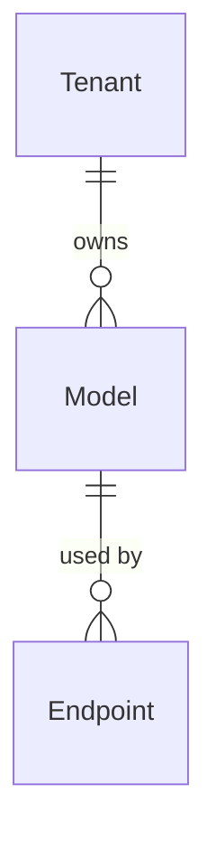

Models represent configured instances of AI language models that generate text responses. Each model is backed by a **model type** that defines how to communicate with the underlying AI service.

## Model entity

A model is defined by the following properties:

```python
class Model:
    id: UUID                # Unique identifier
    tenant_id: UUID         # Tenant isolation
    name: str               # Unique name per tenant
    dtype: str              # Model type (e.g., "openai", "vllm_local")
    configuration: dict     # Type-specific config (API keys, URLs)
    summary: str            # Brief description
    tags: str               # Comma-separated tags
    created_at: datetime
    updated_at: datetime
```

Location: `backend/syft_space/components/models/entities.py:15`

## Model types

Model types implement the `BaseModelType` protocol and provide:

### Configuration schema

Each type defines required fields:

```python
@classmethod
def configuration_schema(cls) -> dict[str, Any]:
    """Return configuration schema for this model type."""
    return {
        "api_key": {"type": "string", "required": True, "secret": True},
        "model": {"type": "string", "required": True},
        "base_url": {"type": "string", "required": False}
    }
```

### Chat interface

All model types implement chat functionality:

```python
async def chat(
    self,
    ctx: ChatContext,
    messages: list[ChatMessage],
    params: ChatParameters | None = None
) -> ChatResult:
    """Generate a response from the model."""
```

Location: `backend/syft_space/components/model_types/interfaces.py:129`

## Chat data models

### ChatMessage

Input messages to the model:

```python
class ChatMessage:
    role: str       # "user", "assistant", or "system"
    content: str    # Message text
```

Location: `backend/syft_space/components/model_types/interfaces.py:18`

### ChatParameters

Control generation behavior:

```python
class ChatParameters:
    temperature: float = 0.7           # Randomness (0.0-2.0)
    max_tokens: int = 100              # Maximum response length
    stop_sequences: list[str] = []     # Stop generation at these strings
    presence_penalty: float = 0.0      # Penalize repeated topics (-2.0 to 2.0)
    frequency_penalty: float = 0.0     # Penalize repeated tokens (-2.0 to 2.0)
    top_p: float = 1.0                 # Nucleus sampling (0.0-1.0)
    extra_options: dict = {}           # Type-specific options
```

Location: `backend/syft_space/components/model_types/interfaces.py:26`

### ChatResult

Model response:

```python
class ChatResult:
    id: str                         # Unique completion ID
    model: str                      # Model name used
    messages: list[ChatMessageResult]  # Generated messages
    finish_reason: str              # "stop", "length", "error", etc.
    usage: TokenUsage               # Token consumption details
    metadata: dict                  # Additional info

class ChatMessageResult:
    role: str       # Message role
    content: str    # Generated text
    tokens: int     # Tokens in this message

class TokenUsage:
    prompt_tokens: int      # Tokens in input
    completion_tokens: int  # Tokens in output
    total_tokens: int       # Sum of both
```

Location: `backend/syft_space/components/model_types/interfaces.py:68`

## Available model types

### OpenAI

**Type name**: `openai`

Connect to OpenAI's API (GPT-4, GPT-3.5, etc.).

**Configuration**:
```json
{
  "api_key": "sk-...",
  "model": "gpt-4",
  "base_url": "https://api.openai.com/v1"  // optional
}
```

**Use cases**:
- Production-grade chat completions
- Function calling
- Advanced reasoning tasks

### vLLM (local)

**Type name**: `vllm_local`

Connect to locally-hosted vLLM inference server.

**Configuration**:
```json
{
  "base_url": "http://localhost:8000",
  "model": "meta-llama/Llama-2-7b-chat-hf"
}
```

**Use cases**:
- Privacy-preserving inference (data never leaves your infrastructure)
- Custom fine-tuned models
- Cost optimization for high-volume use

## Model operations

### Create model

```python
async def create_model(
    request: CreateModelRequest,
    tenant: Tenant
) -> ModelResponse:
    """
    1. Validates model type exists
    2. Validates configuration against schema
    3. Creates model entity
    """
```

Location: `backend/syft_space/components/models/handlers.py:86`

**Request schema**:
```python
class CreateModelRequest:
    name: str               # Unique name per tenant
    dtype: str              # Model type name
    configuration: dict     # Type-specific config
    summary: str = ""       # Optional description
    tags: str = ""          # Comma-separated tags
```

### Update model

Partial updates (only name, summary, tags):

```python
async def update_model(
    name: str,
    request: UpdateModelRequest,
    tenant: Tenant
) -> ModelResponse:
    """
    Updates metadata fields.
    Configuration cannot be updated (delete + recreate instead).
    """
```

<Warning>
Model configuration (API keys, URLs) cannot be updated. To change configuration, delete and recreate the model.
</Warning>

Location: `backend/syft_space/components/models/handlers.py:162`

### Delete model

```python
async def delete_model(name: str, tenant: Tenant) -> dict:
    """Deletes model and cascades to connected endpoints."""
```

Location: `backend/syft_space/components/models/handlers.py:197`

### Healthcheck

Verify model connectivity:

```python
async def healthcheck(name: str, tenant: Tenant) -> HealthcheckResponse:
    """
    Returns:
    - status: HEALTHY or UNHEALTHY
    - message: Details about connection state
    """
```

Location: `backend/syft_space/components/models/handlers.py:217`

## RAG integration

When a model is used in an endpoint with a dataset (response type "both"), search results are automatically injected as context:

```python
# Endpoint handler combines dataset + model
if references and references.documents:
    # Build context from top 3 search results
    context_content = "\n\n".join([
        f"[{doc.document_id}] {doc.content}"
        for doc in references.documents[:3]
    ])
    
    # Inject as system message
    context_message = ChatMessage(
        role="system",
        content=f"Use the following context to answer:\n{context_content}"
    )
    messages.insert(0, context_message)

# Chat with model
chat_result = await model_instance.chat(ctx, messages, params)
```

Location: `backend/syft_space/components/endpoints/handlers.py:481`

This implements the retrieval-augmented generation pattern:
1. Query searches dataset for relevant documents
2. Top results are formatted as context
3. Context + user message sent to model
4. Model generates answer grounded in retrieved documents

## Response format

When querying an endpoint, model responses follow this structure:

```python
class SummaryResponse:
    id: str                     # Completion ID
    model: str                  # Model name used
    message: MessageResponse    # Generated message
    finish_reason: str          # Completion reason
    usage: TokenUsage          # Token consumption
    cost: float                # Generation cost
    provider_info: ProviderInfo # API version, response time

class MessageResponse:
    role: str       # "assistant"
    content: str    # Generated text
    tokens: int     # Token count
```

Location: `backend/syft_space/components/endpoints/schemas.py:336`

## Relationships

- **Tenant**: Each model belongs to one tenant
- **Endpoints**: One model can be used by multiple endpoints



## Context injection

The `ChatContext` object tracks model usage:

```python
class ChatContext(Context):
    sender: str     # Email of user making request (from auth token)
    model_id: UUID  # Model being used
```

This enables:
- Audit logging (who used which model when)
- Usage tracking per sender
- Policy enforcement based on sender identity

Location: `backend/syft_space/components/model_types/interfaces.py:11`

## Example workflow

<Steps>
  <Step title="Create OpenAI model">
    POST `/api/v1/models` with OpenAI credentials
    
    ```json
    {
      "name": "gpt-4-assistant",
      "dtype": "openai",
      "configuration": {
        "api_key": "sk-...",
        "model": "gpt-4"
      }
    }
    ```
  </Step>
  
  <Step title="Test healthcheck">
    GET `/api/v1/models/gpt-4-assistant/healthcheck`
    
    Verifies API key and connectivity
  </Step>
  
  <Step title="Create endpoint">
    Link model to an endpoint (with or without dataset)
    
    ```json
    {
      "slug": "qa-bot",
      "model_id": "<model-uuid>",
      "response_type": "summary"
    }
    ```
  </Step>
  
  <Step title="Query endpoint">
    POST `/api/v1/endpoints/qa-bot/query`
    
    ```json
    {
      "messages": [{"role": "user", "content": "What is RAG?"}],
      "temperature": 0.7,
      "max_tokens": 150
    }
    ```
    
    Returns generated response
  </Step>
</Steps>

## Best practices

<AccordionGroup>
  <Accordion title="Use descriptive names">
    Name models by their purpose: `customer-support-gpt4`, `legal-qa-llama2`
  </Accordion>
  
  <Accordion title="Secure API keys">
    Store API keys in configuration, not hardcoded. They are encrypted in the database.
  </Accordion>
  
  <Accordion title="Test with healthcheck">
    Always run healthcheck after creating a model to verify connectivity before using in endpoints.
  </Accordion>
  
  <Accordion title="Monitor token usage">
    Track `usage.total_tokens` in responses to understand costs and optimize prompts.
  </Accordion>
</AccordionGroup>

## Next steps

<CardGroup cols={2}>
  <Card title="Endpoints" icon="plug" href="/concepts/endpoints">
    Combine models with datasets to create RAG endpoints
  </Card>
  <Card title="Policies" icon="shield" href="/concepts/policies">
    Apply rate limiting and access controls to model usage
  </Card>
</CardGroup>
