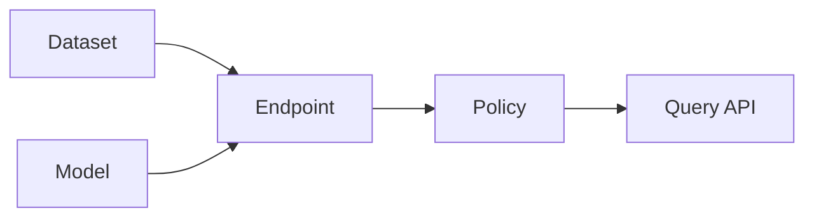

Syft Space is a privacy-preserving SaaS platform that enables you to create secure, AI-powered endpoints by combining datasets, models, and policies. The platform follows a modular architecture where each component serves a specific purpose in the RAG (Retrieval-Augmented Generation) pipeline.

## Core components

Syft Space is built around four primary concepts that work together to create intelligent, policy-controlled endpoints:

<CardGroup cols={2}>
  <Card title="Datasets" icon="database" href="/concepts/datasets">
    Store and search your private data using vector databases like Weaviate or ChromaDB
  </Card>
  <Card title="Models" icon="brain" href="/concepts/models">
    Connect to AI models (OpenAI, local vLLM) to generate intelligent responses
  </Card>
  <Card title="Endpoints" icon="plug" href="/concepts/endpoints">
    Combine datasets and models into queryable API endpoints
  </Card>
  <Card title="Policies" icon="shield" href="/concepts/policies">
    Apply rate limiting and access controls to protect your endpoints
  </Card>
</CardGroup>

## How components relate

Each endpoint can connect to:
- **One dataset** (optional) - for retrieving relevant context
- **One model** (optional) - for generating responses
- **Multiple policies** - for access control and rate limiting

<Note>
At least one of dataset or model must be configured for an endpoint to be valid.
</Note>

## Response types

Endpoints support three response configurations based on which components are connected:

<AccordionGroup>
  <Accordion title="Raw (dataset only)">
    Returns search results from the dataset without model processing. Useful for document retrieval systems.
    
    **Configuration**: `response_type: "raw"`
  </Accordion>
  
  <Accordion title="Summary (model only)">
    Returns generated text from the model without dataset context. Useful for standalone chat interfaces.
    
    **Configuration**: `response_type: "summary"`
  </Accordion>
  
  <Accordion title="Both (dataset + model)">
    Combines dataset search with model generation - the full RAG pipeline. Search results are injected as context for the model.
    
    **Configuration**: `response_type: "both"`
  </Accordion>
</AccordionGroup>

## Multi-tenancy

All components are tenant-isolated:

- Each tenant has their own datasets, models, endpoints, and policies
- Resources cannot be shared across tenants
- All API operations are scoped to the authenticated tenant

## Type system

Each component uses a **type registry** pattern:

- **Dataset types**: `weaviate`, `chromadb_local` - define how data is stored and searched
- **Model types**: `openai`, `vllm_local` - define how AI models are accessed
- **Policy types**: `rate_limit`, `accounting_guard` - define access control rules

Types are registered at startup and provide:
- Configuration schemas (what fields are required)
- Validation logic (ensuring configurations are valid)
- Runtime behavior (how to execute searches, chats, or policy checks)

## Data flow

When a client queries an endpoint:

1. **Pre-hook policies** execute (e.g., rate limit check)
2. **Dataset search** runs (if configured) to find relevant documents
3. **Model chat** executes (if configured) with search results as context
4. **Post-hook policies** execute (e.g., accounting transaction)
5. Response returned to client

<Info>
Policy hooks can block requests at any stage by raising a `PolicyViolationError`.
</Info>

## Next steps

<CardGroup cols={2}>
  <Card title="Datasets" icon="database" href="/concepts/datasets">
    Learn about dataset types, provisioners, and data ingestion
  </Card>
  <Card title="Models" icon="brain" href="/concepts/models">
    Understand model types and chat interfaces
  </Card>
</CardGroup>
