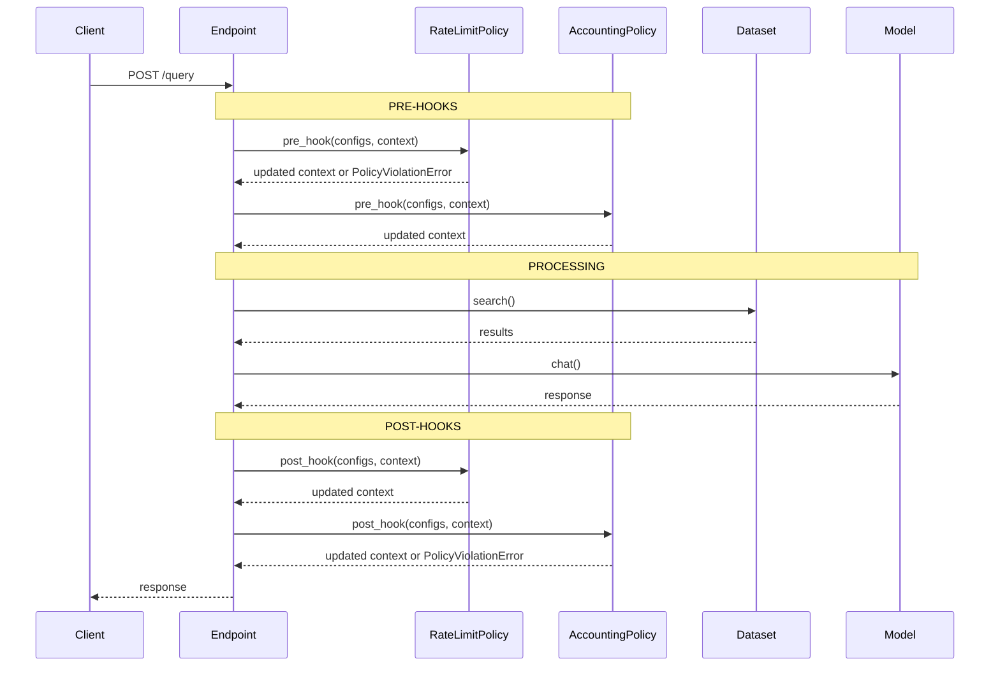
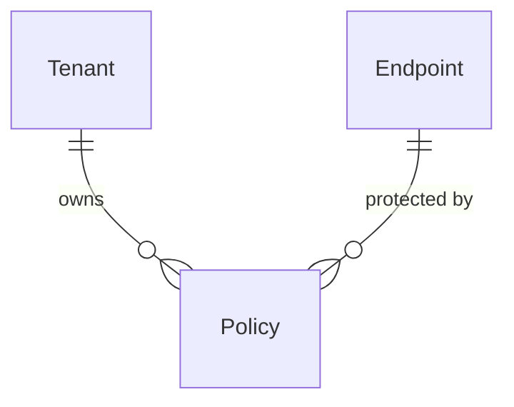

Policies are access control rules attached to endpoints. They execute as **pre-hooks** (before processing) and **post-hooks** (after processing) to enforce limits, track usage, and control access to your AI endpoints.

## Policy entity

A policy is defined by the following properties:

```python
class Policy:
    id: UUID                # Unique identifier
    tenant_id: UUID         # Tenant isolation
    endpoint_id: UUID       # Endpoint this policy protects
    name: str               # Display name (unique per endpoint)
    policy_type: str        # Type of policy (e.g., "rate_limit", "accounting_guard")
    configuration: dict     # Type-specific settings
    created_at: datetime
    updated_at: datetime
```

Location: `backend/syft_space/components/policies/entities.py:15`

<Note>
Policies are endpoint-scoped: each policy belongs to exactly one endpoint. Multiple policies can be attached to the same endpoint.
</Note>

## Policy types

Policy types implement the `BasePolicyType` protocol and provide:

### Configuration schema

Each type defines required fields:

```python
@classmethod
def configuration_schema(cls) -> dict[str, Any]:
    """Return configuration schema for this policy type."""
    return {
        "rate": {
            "type": "string",
            "required": True,
            "description": "Rate limit (e.g., '100/m', '1000/h')"
        }
    }
```

### Hook interface

All policy types implement pre and post hooks:

```python
async def pre_hook(
    self,
    configs: list[dict[str, Any]],
    context: PolicyContext
) -> PolicyContext:
    """Execute before endpoint processing.
    
    Receives ALL configurations for this policy type.
    Can block request by raising PolicyViolationError.
    """

async def post_hook(
    self,
    configs: list[dict[str, Any]],
    context: PolicyContext
) -> PolicyContext:
    """Execute after endpoint processing.
    
    Can block response by raising PolicyViolationError.
    Typically used for accounting, logging, auditing.
    """
```

Location: `backend/syft_space/components/policy_types/interfaces.py:94`

## Policy context

Policies receive execution context with request/response information:

```python
class PolicyContext:
    endpoint_slug: str          # Endpoint being accessed
    sender_email: EmailStr      # Verified user email from auth token
    request: dict[str, Any]     # Original query request
    response: dict[str, Any] | None  # Response (for post hooks)
    metadata: dict[str, Any]    # Additional context (accounting creds, etc.)
```

Location: `backend/syft_space/components/policy_types/interfaces.py:30`

### Key context fields

<AccordionGroup>
  <Accordion title="sender_email">
    Verified email address extracted from SyftHub authentication token.
    
    **Use cases**:
    - Rate limiting per user
    - Usage tracking
    - Access control lists
    
    **Important**: This is NOT user-provided. It's cryptographically verified from the auth token, so policies can trust this identity.
  </Accordion>
  
  <Accordion title="metadata">
    Additional context injected by the endpoint handler.
    
    **Example**: Accounting credentials
    ```python
    metadata = {
        "accounting_email": "user@example.com",
        "accounting_password": "encrypted-password",
        "accounting_url": "https://accounting.syftbox.org"
    }
    ```
    
    Policies can read from and write to metadata to share state between hooks.
  </Accordion>
  
  <Accordion title="request">
    The full query request payload:
    - `messages`: User input
    - `temperature`, `max_tokens`: Model parameters
    - `similarity_threshold`, `limit`: Search parameters
    - `transaction_token`: Accounting token (if provided)
  </Accordion>
  
  <Accordion title="response">
    Only available in post hooks:
    - `summary`: Model-generated response
    - `references`: Dataset search results
    
    Policies can modify the response before returning to client.
  </Accordion>
</AccordionGroup>

## Policy violation errors

Policies block requests by raising exceptions:

```python
class PolicyViolationError(Exception):
    def __init__(
        message: str,
        policy_type: str,
        details: dict[str, Any] | None = None
    ):
        """Raised when a policy rule is violated.
        
        Args:
            message: Human-readable error
            policy_type: Name of policy that failed
            details: Additional context
        """
```

Location: `backend/syft_space/components/policy_types/interfaces.py:8`

**Handler behavior**:
```python
try:
    context = await policy.pre_hook(configs, context)
except PolicyViolationError as e:
    raise HTTPException(
        status_code=403,
        detail=f"Policy '{e.policy_type}' blocked request: {e.details}"
    )
```

Location: `backend/syft_space/components/endpoints/handlers.py:302`

## Execution flow

Policies execute in the endpoint query pipeline:



### Multiple policies per type

When multiple policies of the same type are attached to an endpoint, **all configurations are passed to a single policy instance**:

```python
# Example: 2 rate limit policies on one endpoint
policies = [
    {"name": "Per-user limit", "config": {"rate": "100/h"}},
    {"name": "Global limit", "config": {"rate": "1000/h"}}
]

# Both configs passed to one RateLimitPolicy instance
configs = [{"rate": "100/h"}, {"rate": "1000/h"}]
await rate_limit_policy.pre_hook(configs, context)
```

The policy type decides aggregation logic:
- **AND** logic: All conditions must pass
- **OR** logic: Any condition can pass
- **Custom**: Policy-specific behavior

Location: `backend/syft_space/components/endpoints/handlers.py:285`

## Available policy types

### Rate limit

**Type name**: `rate_limit`

Limits the number of requests per time window.

**Configuration**:
```json
{
  "rate": "100/m"  // Format: <count>/<unit> where unit = s/m/h/d
}
```

**Behavior**:
- **Pre-hook**: Checks if sender has exceeded rate limit
- **Post-hook**: No-op

**Use cases**:
- Prevent abuse
- Enforce API quotas
- Tier-based access (free vs paid users)

### Accounting guard

**Type name**: `accounting_guard`

Enforces payment/credits before allowing access. Confirms transaction after response.

**Configuration**:
```json
{
  "cost_per_request": 0.01,
  "currency": "USD"
}
```

**Behavior**:
- **Pre-hook**: Validates user has sufficient credits, reserves cost
- **Post-hook**: Confirms transaction, deducts credits

**Use cases**:
- Paid API access
- Credit-based systems
- Pay-per-query models

<Warning>
**Data integrity**: Accounting policies can block in post-hook if transaction confirmation fails. This prevents returning responses that weren't paid for.
</Warning>

## Policy operations

### Create policy

```python
async def create_policy(
    request: CreatePolicyRequest,
    tenant: Tenant
) -> PolicyResponse:
    """
    1. Validates policy type exists
    2. Validates configuration against schema
    3. Verifies endpoint exists
    4. Creates policy entity
    """
```

Location: `backend/syft_space/components/policies/handlers.py:84`

**Request schema**:
```python
class CreatePolicyRequest:
    name: str               # Unique per endpoint
    policy_type: str        # Policy type name
    configuration: dict     # Type-specific config
    endpoint_id: UUID       # Endpoint to attach to
```

### Update policy

Partial updates (name, configuration merge):

```python
async def update_policy(
    policy_id: UUID,
    request: UpdatePolicyRequest,
    tenant: Tenant
) -> PolicyResponse:
    """
    Updates name and/or merges configuration.
    Re-validates merged configuration against schema.
    """
```

<Info>
Configuration updates are **shallow merged**: new keys override existing, missing keys are preserved.
</Info>

Location: `backend/syft_space/components/policies/handlers.py:164`

### Delete policy

```python
async def delete_policy(policy_id: UUID, tenant: Tenant) -> dict:
    """Removes policy from endpoint."""
```

Location: `backend/syft_space/components/policies/handlers.py:216`

### List policies by endpoint

```python
async def get_policies_by_endpoint(
    endpoint_id: UUID,
    tenant: Tenant
) -> list[PolicyResponse]:
    """Get all policies attached to an endpoint."""
```

Location: `backend/syft_space/components/policies/handlers.py:245`

## Grouped policy execution

Endpoint handler groups policies by type before execution:

```python
# Get all policies for endpoint
policies = await policy_repository.get_by_endpoint_id(endpoint.id, tenant.id)

# Group by policy type
policies_by_type = {
    "rate_limit": [policy1, policy2],
    "accounting_guard": [policy3]
}

# Extract configurations per type
configs_by_type = {
    "rate_limit": [policy1.configuration, policy2.configuration],
    "accounting_guard": [policy3.configuration]
}

# Execute one instance per type with all configs
for policy_type, configs in configs_by_type.items():
    policy_cls = registry.get_policy_type(policy_type)
    policy_instance = policy_cls()  # Stateless instance
    await policy_instance.pre_hook(configs, context)
```

Location: `backend/syft_space/components/endpoints/handlers.py:285`

This design allows:
- Efficient batching (one DB query for all policies)
- Type-specific aggregation logic
- Clean separation of concerns

## Relationships



- **Tenant**: Each policy belongs to one tenant
- **Endpoint**: Each policy protects one endpoint (many policies per endpoint)

## Example workflows

<Tabs>
  <Tab title="Rate limiting">
    <Steps>
      <Step title="Create endpoint">
        Create a published endpoint that needs protection
      </Step>
      
      <Step title="Add rate limit policy">
        POST `/api/v1/policies`
        
        ```json
        {
          "name": "100 requests per hour",
          "policy_type": "rate_limit",
          "configuration": {"rate": "100/h"},
          "endpoint_id": "<endpoint-uuid>"
        }
        ```
      </Step>
      
      <Step title="Query endpoint">
        Clients can make up to 100 requests/hour
        
        101st request returns:
        ```json
        {
          "detail": "Policy 'rate_limit' blocked request: Rate limit exceeded"
        }
        ```
      </Step>
    </Steps>
  </Tab>
  
  <Tab title="Tiered access">
    <Steps>
      <Step title="Create free tier limit">
        ```json
        {
          "name": "Free tier: 10/day",
          "policy_type": "rate_limit",
          "configuration": {"rate": "10/d"}
        }
        ```
      </Step>
      
      <Step title="Create paid tier limit">
        ```json
        {
          "name": "Paid tier: 1000/day",
          "policy_type": "rate_limit",
          "configuration": {"rate": "1000/d"}
        }
        ```
      </Step>
      
      <Step title="Policy decides based on user">
        Policy can check user tier from `sender_email` and apply appropriate limit
      </Step>
    </Steps>
  </Tab>
  
  <Tab title="Accounting guard">
    <Steps>
      <Step title="Configure accounting marketplace">
        Set up marketplace with accounting credentials
      </Step>
      
      <Step title="Add accounting policy">
        ```json
        {
          "name": "Pay per query",
          "policy_type": "accounting_guard",
          "configuration": {
            "cost_per_request": 0.01,
            "currency": "USD"
          }
        }
        ```
      </Step>
      
      <Step title="Query with transaction token">
        Client includes `transaction_token` in request
        
        Pre-hook validates payment, post-hook confirms
      </Step>
    </Steps>
  </Tab>
</Tabs>

## Best practices

<AccordionGroup>
  <Accordion title="Layer multiple policies">
    Combine rate limiting with accounting for comprehensive protection:
    - Rate limit prevents abuse even for paid users
    - Accounting ensures payment
  </Accordion>
  
  <Accordion title="Use descriptive names">
    Name policies by their purpose: `"Premium users: 1000/hour"`, `"$0.01 per query"`
  </Accordion>
  
  <Accordion title="Test policies separately">
    Create test endpoints with single policies to verify behavior before combining
  </Accordion>
  
  <Accordion title="Monitor policy violations">
    Log `PolicyViolationError` exceptions to understand usage patterns and adjust limits
  </Accordion>
  
  <Accordion title="Handle graceful degradation">
    If accounting service is down, policies can choose to:
    - Block all requests (strict)
    - Allow requests with warning log (graceful)
    
    Design depends on business requirements
  </Accordion>
</AccordionGroup>

## Next steps

<CardGroup cols={2}>
  <Card title="Endpoints" icon="plug" href="/concepts/endpoints">
    Learn how policies integrate into the endpoint query flow
  </Card>
  <Card title="Overview" icon="book" href="/concepts/overview">
    Review how all components work together
  </Card>
</CardGroup>
